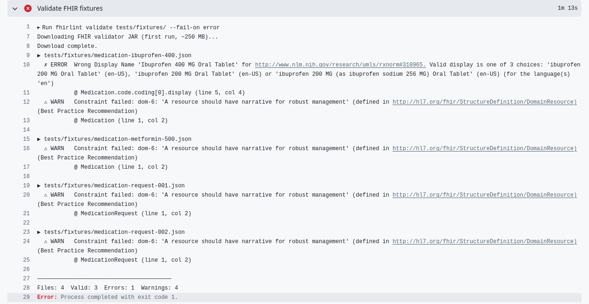

# example-fhir-medication-api

[](https://github.com/fhirlint/example-fhir-medication-api/actions/workflows/test.yml)
[](https://github.com/fhirlint/example-fhir-medication-api/actions/workflows/fhirlint.yml)
[](https://github.com/fhirlint/example-fhir-medication-api/actions/workflows/security.yml)

A minimal Symfony REST API that serves FHIR R4 Medication and MedicationRequest resources. It demonstrates how to integrate [fhirlint](https://github.com/fhirlint/fhirlint) into a PHP project's CI pipeline to automatically validate FHIR resources on every push.

## What this example shows

- Returning valid FHIR R4 resources from Symfony controllers with `application/fhir+json` content type
- Storing FHIR fixture files in `tests/fixtures/` as the single source of truth for test data
- Running `fhirlint validate` against those fixtures in CI — the build fails if any resource is invalid
- PHPUnit tests that assert API responses match the fixture data
- Static analysis at PHPStan level 10

## Requirements

- PHP 8.4+
- Composer
- Symfony CLI (optional, for local dev server)

## Getting started

```bash
git clone https://github.com/fhirlint/example-fhir-medication-api.git
cd example-fhir-medication-api
composer install
symfony server:start
```

Or without Symfony CLI:

```bash
php -S localhost:8000 -t public/
```

## API endpoints

All responses use `Content-Type: application/fhir+json`.

| Method | Path | Description |
|--------|------|-------------|
| `GET` | `/fhir/Medication` | List all medications (FHIR Bundle) |
| `GET` | `/fhir/Medication/{id}` | Read a single Medication resource |
| `GET` | `/fhir/MedicationRequest` | List all medication requests (FHIR Bundle) |
| `GET` | `/fhir/MedicationRequest/{id}` | Read a single MedicationRequest resource |

### Example

```bash
curl http://localhost:8000/fhir/Medication/ibuprofen-400
```

```json
{
  "resourceType": "Medication",
  "id": "ibuprofen-400",
  "status": "active",
  "code": {
    "coding": [{ "system": "http://www.nlm.nih.gov/research/umls/rxnorm", "code": "310965", "display": "Ibuprofen 400 MG Oral Tablet" }],
    "text": "Ibuprofen 400mg"
  }
}
```

## FHIR validation in CI

When a fixture contains an invalid FHIR resource, fhirlint fails the build with a clear error:




The `fhirlint` workflow validates all files in `tests/fixtures/` on every push:

```yaml
- name: Validate FHIR fixtures
  run: fhirlint validate tests/fixtures/ --fail-on error
```

If a fixture contains an invalid FHIR resource, the build fails immediately. To validate locally:

```bash
# Install fhirlint (requires Java 11+)
gh release download --repo fhirlint/fhirlint --pattern "*linux_amd64.tar.gz"
tar xzf fhirlint_*_linux_amd64.tar.gz && sudo mv fhirlint /usr/local/bin/

# Validate all fixtures
fhirlint validate tests/fixtures/
```

## Running tests

```bash
php bin/phpunit
```

```bash
php vendor/bin/phpstan analyse --no-progress
```

## Project structure

```
tests/
└── fixtures/
    ├── medication-ibuprofen-400.json    # FHIR Medication resource
    ├── medication-metformin-500.json    # FHIR Medication resource
    ├── medication-request-001.json      # FHIR MedicationRequest with dosage
    └── medication-request-002.json      # FHIR MedicationRequest with dosage
src/
└── Controller/
    └── FhirController.php               # All FHIR endpoints
```

## Related

- [fhirlint](https://github.com/fhirlint/fhirlint) — the validator CLI used in this example
- [HL7 FHIR R4 Medication](https://hl7.org/fhir/R4/medication.html)
- [HL7 FHIR R4 MedicationRequest](https://hl7.org/fhir/R4/medicationrequest.html)

---

HL7® FHIR® is a registered trademark of Health Level Seven International.
